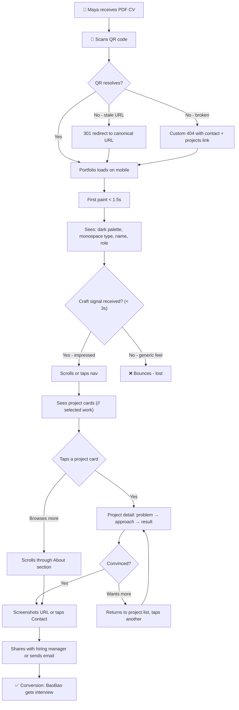
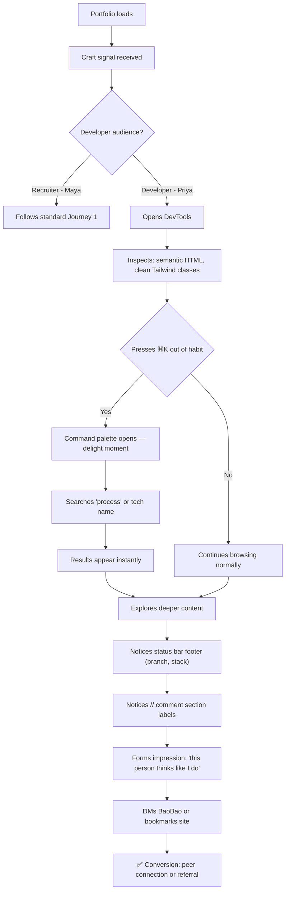
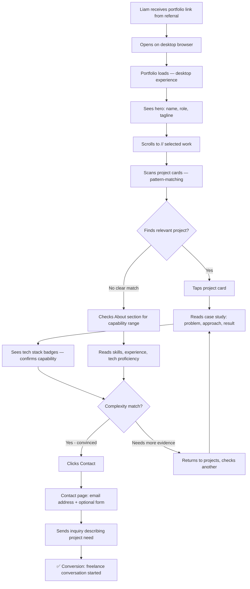
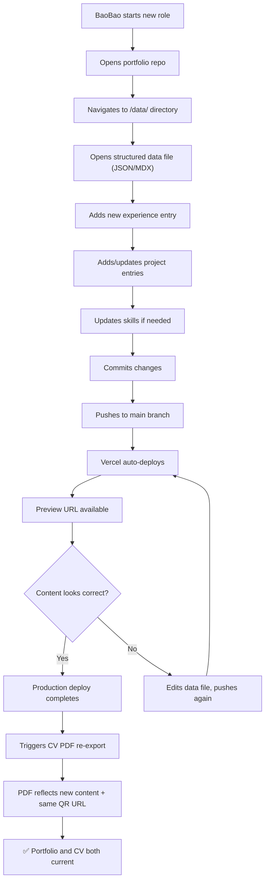

# UX Design Specification MyPortfolio

**Author:** BaoBao
**Date:** 2026-04-28

---

## Executive Summary

### Project Vision

MyPortfolio is a two-surface conversion engine: a coding-aesthetic web portfolio and a PDF CV export, unified by a single structured data source. The CV's embedded QR code bridges the recruiter's paper-screening workflow directly into the digital experience — collapsing the gap between static credentials and living proof of craft. The portfolio exists to make one thing undeniable: this person is hireable.

### Target Users

**Primary — The Recruiter (Maya).** Screens 40 CVs per week. Encounters BaoBao's PDF, scans the QR code on her phone. Needs to read "high-craft developer" within 10 seconds. The portfolio must advance BaoBao from the "maybe" pile to the first-interview list — faster than reading a cover letter could.

**Secondary — The Freelance Client (Liam).** Arrives via direct link from a referral. Pattern-matching for evidence: has this person shipped real things at the complexity I need? Needs scannable project summaries, visible tech stack tags, and a frictionless contact path.

**Tertiary — The Peer Developer (Priya).** Finds the portfolio shared in a community. Opens DevTools. Wants to see technical craft: clean markup, intentional architecture, tasteful animation. The code quality IS the portfolio for this user.

**Owner — BaoBao.** Updates content (experience, projects, skills) by editing structured data files. No component code changes. Re-exports the CV PDF at any time to reflect current content and canonical URL.

### Key Design Challenges

1. **The 10-Second Mobile Test.** The primary conversion path starts on a phone (QR scan). The mobile-first experience must communicate craft, competence, and personality before the recruiter scrolls. No slow loads, no layout jank, no "best viewed on desktop" apologies.

2. **Two Surfaces, One Identity.** The PDF CV and web portfolio must share a design language — typography, spacing, information hierarchy. If one feels like a different person made it, the trust loop breaks.

3. **Coding Aesthetic as Authentic Signal.** Terminal motifs, monospace typography, dark palette, and developer-native interaction patterns (command palette, keyboard navigation) must feel lived-in, not costumed. The aesthetic should be indistinguishable from the person's actual working environment.

4. **Animation Restraint Under Performance Pressure.** GSAP and Framer Motion are available, but every animation must pass two tests: does it communicate craft, and does it degrade gracefully? `prefers-reduced-motion` is a hard gate, not a nice-to-have.

### Design Opportunities

1. **Command Palette Navigation (⌘K / Ctrl+K).** A fuzzy-search command palette as the primary navigation mechanism — developer-native, minimal, and deeply functional. Mirrors tools the target audience already uses daily. Clean fallback nav for non-keyboard users.

2. **The B-Side Layer.** A polished public surface for recruiters and clients. A deeper process/thinking layer (accessible via command palette or mode toggle) for peer developers and the deeply curious. Two identities, one URL.

3. **Typography-Driven Visual Identity.** Monospace typography (JetBrains Mono or Geist Mono) at expressive scale contrasts as the primary visual design element. No hero images needed — the type IS the aesthetic.

4. **The CV ↔ Portfolio Feedback Loop.** The QR-coded PDF export is not a feature — it's the primary distribution channel. The QR landing experience (mobile, fast, immediately compelling) is the single most important UX moment on the entire site.

## Core User Experience

### Defining Experience

The core experience of MyPortfolio is a **two-beat conversion sequence**:

**Beat 1 — The Instant Signal (mobile, <3 seconds).** A recruiter scans a QR code from BaoBao's PDF CV. The portfolio loads on her phone. Before she scrolls, the dark palette, monospace typography, and precise spacing have already communicated: _this person cares about craft at the pixel level._ This is the gate — if it fails, nothing else matters.

**Beat 2 — The Proof Point (mobile or desktop, <60 seconds).** She taps into one project. A concise case write-up with visible tech stack tags confirms the signal: this is someone who ships real things. She screenshots the URL to share with the hiring manager. Conversion complete.

Every other interaction — freelance client browsing, peer developer inspecting DevTools, owner updating content — succeeds automatically if these two beats are nailed.

### Platform Strategy

| Platform            | Role                                                             | Design Priority                                                       |
| ------------------- | ---------------------------------------------------------------- | --------------------------------------------------------------------- |
| **Mobile**          | First impression surface (QR scan landing)                       | Primary — mobile-first layout, fast load, immediate craft signal      |
| **Desktop**         | Deep engagement surface (sustained browsing, project deep-dives) | Secondary — richer interactions, command palette, fuller animations   |
| **PDF (CV export)** | Distribution channel (paper → digital bridge)                    | Companion — shared design language with web, QR code to canonical URL |

- Mobile is where trust is won or lost. Desktop is where depth is explored.
- CV export is desktop-triggered; mobile surfaces a clean "view on desktop" fallback for export.
- No offline functionality required — the portfolio is an online-first experience.

### Effortless Interactions

**Must feel effortless (zero cognitive load):**

- QR scan → portfolio load → craft signal. No splash screens, no cookie banners, no interstitials.
- Navigating between sections. Minimal visible nav bar — Home, Projects, About, Contact. No hamburger menu gymnastics.
- Finding contact information. Email or contact CTA visible on every page, not buried behind a "Contact" nav item alone.
- Reading a project summary. Title, tech stack badges, one-paragraph outcome — scannable in 5 seconds.

**Must feel delightful (rewarding for the attentive):**

- ⌘K / Ctrl+K command palette for keyboard-native navigation. Hidden but discoverable — developer audiences recognize the pattern instantly.
- Subtle micro-animations on scroll and interaction — page transitions, hover reveals, cursor details. Present on desktop, suppressed gracefully under `prefers-reduced-motion`.
- Code-quality visible in DevTools — clean markup, semantic HTML, intentional class naming. The source code is a portfolio piece.

**Must happen automatically (no user action needed):**

- Responsive adaptation across breakpoints. No "switch to desktop" friction.
- QR code URL sourced from config at export time. No manual URL updates after domain changes.
- Content updates flow from structured data files to both web and PDF without component changes.

### Critical Success Moments

1. **The QR Landing (make-or-break).** The recruiter's phone loads the portfolio. In under 3 seconds, the dark coding aesthetic, fast paint, and confident typography must communicate: _this is not a template site._ If this moment stutters, jitters, or looks generic, the recruiter moves to the next CV.

2. **The Project Tap (conversion point).** The recruiter taps into a single project. The case summary must be scannable — problem, approach, result, tech stack — in under 15 seconds. If she has to scroll through a wall of text, she'll back out.

3. **The First ⌘K (delight moment).** A peer developer presses ⌘K out of instinct. The command palette opens. They search "process" or a tech name. Results appear instantly. This is the moment they DM BaoBao: _"Loved your portfolio."_

4. **The Content Update (owner confidence).** BaoBao gets a new job. Opens a data file, adds an entry, deploys. The site and CV export both reflect the change. No code editing, no CSS surprises. Confidence that the portfolio stays current without friction.

### Experience Principles

1. **Craft is the message.** Every pixel, every transition, every line of markup is evidence. The portfolio doesn't describe skill — it demonstrates it. If an element doesn't communicate craft, it doesn't belong.

2. **Respect the recruiter's time.** The primary user is screening 40 CVs this week. The portfolio earns attention through speed and clarity, not through demanding it with long animations or mandatory scroll journeys.

3. **Depth on demand, not by default.** The surface is clean and scannable for recruiters. The command palette, process layer, and code quality exist as deeper layers for those who seek them. Two audiences, one URL, no compromise.

4. **The container IS the content.** A Next.js 16 + Tailwind CSS v4 + GSAP portfolio built with visible craft IS the strongest possible portfolio piece for a frontend developer. The technology choices are not implementation details — they are the message.

## Desired Emotional Response

### Primary Emotional Goals

| User                 | Desired Emotion                                                      | What Triggers It                                                         |
| -------------------- | -------------------------------------------------------------------- | ------------------------------------------------------------------------ |
| **Recruiter**        | Quietly impressed — "this person operates at a level above their CV" | Fast load, dark coding aesthetic, precise typography, zero friction      |
| **Freelance Client** | Professional confidence — "this person ships clean work"             | Scannable project summaries, visible tech stacks, clear outcomes         |
| **Peer Developer**   | Respect + curiosity — "this person thinks like I aspire to"          | Clean markup in DevTools, command palette discovery, animation restraint |
| **Owner**            | In control — "I can keep this current without breaking anything"     | Structured data files, predictable content flow, no-code updates         |

The unifying emotion across all users is **trust through craft** — the feeling that every visible (and invisible) detail was an intentional decision.

### Emotional Journey Mapping

**First Contact (0–3 seconds):**
_Intrigue → Recognition._ The dark palette and monospace type register instantly as "developer." Not generic, not a template. The visitor's mental model shifts from "another portfolio" to "someone who cares about this."

**Exploration (3–30 seconds):**
_Confidence → Respect._ Navigating feels effortless. Content is scannable. The aesthetic is consistent. Each scroll confirms the initial impression — this wasn't a lucky first screen, it's the whole experience.

**Deep Dive (30–120 seconds):**
_Curiosity → Admiration._ A project page reveals clear thinking — problem, approach, result. Tech stack badges are honest. For the developer audience, DevTools reveals semantic HTML and clean Tailwind classes. The command palette (⌘K) triggers a moment of genuine delight.

**Exit / Return:**
_Memorability → Action._ The visitor leaves with a clear mental image — "the dark portfolio with the clean type." The recruiter screenshots the URL. The freelance client sends a message. The peer developer bookmarks or shares it.

**Error / Edge Case:**
_Composure → Wit._ If something breaks (404, stale URL), the error state should feel intentional — terminal-styled error messages, a redirect to a project, or BaoBao's email. Errors should reinforce the coding personality, not break it.

### Micro-Emotions

**Confidence over Confusion** — Navigation is always obvious. The visitor never asks "where am I?" or "how do I get back?" Minimal nav bar, clear section hierarchy, consistent layout patterns.

**Trust over Skepticism** — Content is current (visible "last updated" signals), projects show real outcomes (not vaporware), and the aesthetic says "I built this myself." No stock photography, no template giveaways.

**Delight over Mere Satisfaction** — The command palette, the subtle cursor interactions, the smooth page transitions — these are moments that elevate the experience from "good portfolio" to "this person gets it." Delight is earned through precision, not excess.

**Calm over Anxiety** — The pacing of the site should feel unhurried but not slow. White space breathes. Animations are brief and purposeful. The recruiter should never feel like the site is demanding her attention — it should earn it through restraint.

### Design Implications

| Emotion                 | UX Design Choice                                                                               |
| ----------------------- | ---------------------------------------------------------------------------------------------- |
| Quietly impressed       | Sub-2-second FCP; dark palette renders immediately; no layout shift                            |
| Professional confidence | Project cards with structured data — title, stack badges, one-line outcome                     |
| Respect + curiosity     | Semantic HTML; BEM or utility-class discipline visible in DevTools; ⌘K command palette         |
| In control (owner)      | Content schema documented; data file structure intuitive; deploy previews                      |
| Composure in error      | Custom 404 with terminal-style messaging; QR fallback to canonical URL                         |
| Calm pacing             | Max 300ms for micro-animations; no scroll hijacking; generous whitespace                       |
| Delight without excess  | Hover reveals, subtle cursor effects — desktop only; suppressed under `prefers-reduced-motion` |

### Emotional Design Principles

1. **Impress through restraint, not spectacle.** The portfolio should feel like a well-tailored suit, not a fireworks show. Every animation, every interaction, every color choice should whisper quality — never shout for attention.

2. **Trust is built in the details.** Current content dates, consistent spacing, clean code in DevTools, fast loads — trust accumulates from dozens of small signals, not one grand gesture.

3. **Delight is a privilege, not a default.** Micro-animations and the command palette are rewards for attentive, engaged visitors. The base experience is clean and fast. Delight layers on top — never at the expense of clarity or speed.

4. **Error is personality, not failure.** Every edge case — 404s, slow connections, stale QR URLs — is an opportunity to reinforce the developer identity. Terminal-styled errors, graceful fallbacks, and wit in unexpected places.

## UX Pattern Analysis & Inspiration

### Inspiring Products Analysis

**VS Code — The Command Palette Paradigm**
The most relevant interaction pattern for MyPortfolio's audience. VS Code's ⌘K/Ctrl+P command palette is zero-friction navigation: fuzzy search, keyboard-first, instant results. The status bar provides persistent context (current file, language, branch) without visual weight. The dark theme palette (One Dark, Tokyo Night, Dracula) has become a cultural signifier — developers recognize these color systems the way designers recognize Pantone swatches. **Lesson: the command palette isn't a feature to add — it's a shared vocabulary to speak.**

**Linear — Opinionated Professional Confidence**
Linear's UX is the emotional benchmark for MyPortfolio. Dark interface, fast transitions (never zero, never slow), keyboard shortcuts discoverable but not required. What Linear nails: the feeling of "this was built by someone who uses it." No onboarding tour, no tooltip avalanche — the interface respects the user's intelligence. The typography is clean, the spacing is generous, and every interaction feels like it was debated and earned. **Lesson: professional confidence means making opinionated choices and committing to them. No "it depends" in the UI.**

**GitHub Profile + README — Structured Developer Identity**
The closest existing competitive surface to MyPortfolio. Pinned repositories, contribution graph, tech badges, markdown-rendered README as personal statement. What GitHub does well: structured, scannable data presentation. What it lacks entirely: personality, craft signal, emotional resonance, and any path to conversion. A GitHub profile says "here are my repos." MyPortfolio must say "here is why you should hire me." **Lesson: steal the data structure (badges, stack tags, contribution signals), reject the emotional flatness.**

**Vercel Dashboard / Geist Design System — The Native Aesthetic**
BaoBao's deployment platform and the audience's daily environment. Geist typography (Geist Sans + Geist Mono), the Vercel dark palette, and the dashboard's information density set the visual baseline. The Next.js documentation demonstrates that monospace type + generous whitespace + dark backgrounds can make complex content feel calm rather than intimidating. **Lesson: Geist Mono or JetBrains Mono as the portfolio's type voice will feel native to the ecosystem, not imported from a design trend.**

**Stripe Documentation — Craft as Credibility**
Stripe's docs are the gold standard for "the quality of the documentation proves the quality of the product." Code samples are syntax-highlighted and copy-ready. Navigation is fast and predictable. The design is restrained but never boring. **Lesson: for a developer portfolio, the site's code quality and interaction polish function exactly like Stripe's docs — the container IS the credibility proof.**

### Transferable UX Patterns

**Navigation Patterns:**

- **Command Palette (VS Code / Linear)** — ⌘K fuzzy search as a power-user navigation layer. Not primary nav (recruiters won't know the shortcut), but discoverable and instantly functional for developer audiences. Implement with `cmdk` library.
- **Minimal Persistent Nav Bar (Linear)** — 4 items max: Home, Projects, About, Contact. No dropdowns, no mega-menus. Collapses to a clean mobile nav (not a hamburger icon with 12 nested items).
- **Keyboard Shortcuts (GitHub / Linear)** — `G+P` for Projects, `G+A` for About, `G+C` for Contact. A `?` overlay shows available shortcuts. Optional but deeply appreciated by the target audience.

**Interaction Patterns:**

- **Fast Transitions (Linear)** — Page transitions at 200–300ms. Present but not lingering. The user should feel motion without waiting for it. GSAP for scroll-triggered reveals; Framer Motion for layout transitions.
- **Hover Reveals (Vercel Dashboard)** — Project cards show additional context (tech stack, date, brief outcome) on hover. Desktop only — mobile shows all info by default.
- **Syntax-Highlighted Code Blocks (Stripe Docs)** — Project case studies can include actual code snippets — architectural decisions, before/after diffs — as first-class content. Shows rather than tells technical thinking.

**Visual Patterns:**

- **Dark-First Palette (VS Code themes)** — Dark background as default, drawn from editor theme conventions. Not pure black (#000) — a warm or cool dark gray that reduces eye strain. Accent color used surgically: one hue, applied sparingly for interactive elements and emphasis.
- **Monospace Type Hierarchy (Vercel/Geist)** — Single monospace family at varied weights and scales. Headings at large scale, body at comfortable reading size, metadata at small scale. The type family unifies everything without needing a second font.
- **Badge/Tag System (GitHub)** — Tech stack badges on project cards using the shield.io / GitHub convention. Instantly scannable, culturally familiar to developer audiences.

**Information Architecture Patterns:**

- **Structured Project Cards (GitHub Pinned Repos)** — Title, one-line description, tech stack tags, and a visual indicator of project type. Scannable in 3 seconds.
- **Progressive Disclosure (Stripe Docs)** — Summary visible by default; details revealed on click/tap. Respects the recruiter's scanning behavior while providing depth for those who seek it.

### Anti-Patterns to Avoid

| Anti-Pattern                                    | Why It Fails                                                                | What to Do Instead                                                             |
| ----------------------------------------------- | --------------------------------------------------------------------------- | ------------------------------------------------------------------------------ |
| **Scroll-hijacked hero animations**             | Forces the recruiter to wait; signals ego over empathy                      | Content above the fold immediately; animations enhance, not gate               |
| **Hamburger menu hiding critical nav**          | Mobile users (QR scanners) can't find what they need                        | Visible minimal nav bar; 4 items fit on any mobile screen                      |
| **Template-detectable aesthetics**              | Instantly kills the "I built this myself" signal                            | Custom color palette, unique spacing rhythm, no stock components               |
| **Wall-of-text case studies**                   | Recruiters scan, they don't read; Liam the client pattern-matches           | Structured cards: title, stack, one-paragraph outcome, then optional deep-dive |
| **Autoplay video/audio**                        | Breaks trust immediately; hostile in a screening context                    | Static by default; motion on interaction only                                  |
| **Cookie consent banners**                      | No cookies = no banner needed; the absence IS the statement                 | Zero tracking by default (MVP); add analytics consent in Phase 2 only          |
| **"Best viewed on desktop" warnings**           | Insults the mobile user who arrived via QR code                             | Mobile-first design; desktop enhances, never gates                             |
| **Social proof sections (testimonials, logos)** | Feels desperate on a personal portfolio; breaks the "quiet confidence" tone | Let the work speak; the site's craft IS the social proof                       |

### Design Inspiration Strategy

**Adopt Directly:**

- Command palette interaction pattern (VS Code / Linear) — the defining developer-native UX feature
- Dark-first color palette drawn from editor theme conventions — instant cultural recognition
- Monospace typography as the singular type voice — Geist Mono or JetBrains Mono
- Badge/tag system for tech stacks on project cards — universal developer visual language
- Fast, purposeful transitions at 200–300ms (Linear's timing philosophy)

**Adapt for This Context:**

- GitHub's structured data presentation → project cards with problem/outcome framing (not just repo metadata)
- Stripe's code-sample presentation → code snippets in case studies showing architectural decisions (not API docs)
- Linear's keyboard shortcuts → optional navigation layer with `?` help overlay (not a requirement for core use)
- VS Code status bar → persistent footer with current section, stack indicator, availability status (decorative, not functional)

**Avoid Entirely:**

- Template-site aesthetics — no component libraries used visibly (even if used structurally)
- Social proof patterns — no testimonials, client logos, or "trusted by" sections
- Content-gating patterns — no email capture, no "subscribe to see more," no login walls
- Aggressive animation — no parallax scrolling, no scroll-jacking, no mandatory animation sequences

## Design System Foundation

### Design System Choice

**Custom Design System built on Tailwind CSS v4** — no external component library. Every component hand-crafted, every design token intentional, every interaction bespoke.

### Rationale for Selection

1. **The portfolio IS the proof.** Using a recognizable component library (shadcn/ui, MUI, Chakra) would undermine the core message. Peer developers WILL inspect the source. If they find shadcn defaults or Radix primitives with minimal customization, the "craft" claim falls apart.

2. **Tailwind CSS v4 is the foundation, not the system.** Tailwind provides the utility layer — spacing, color, typography, responsive design. The design system lives in the tokens, the component patterns, and the interaction conventions we define on top of it.

3. **Scope justifies it.** MyPortfolio is a personal portfolio with ~4–6 page types and a handful of component patterns (nav, project card, section layout, footer, command palette). This is not a 200-component enterprise system — it's a tight, opinionated set of building blocks that one developer can maintain.

4. **Performance alignment.** No component library runtime. No CSS-in-JS overhead. Tailwind compiles to static CSS; GSAP and Framer Motion handle interaction. The Lighthouse >= 90 target is achievable without fighting library bloat.

### Implementation Approach

**Design Token Layer (Tailwind Config):**

| Token Category    | Approach                                                                                                                                                                              |
| ----------------- | ------------------------------------------------------------------------------------------------------------------------------------------------------------------------------------- |
| **Color**         | Custom dark palette derived from editor theme conventions. Background: warm dark gray (not #000). Accent: single hue, used surgically. Text: high-contrast white/gray hierarchy.      |
| **Typography**    | Geist Mono or JetBrains Mono as the sole typeface. Scale: 12px (metadata) → 16px (body) → 24px (h3) → 32px (h2) → 48–64px (h1/hero). Weight: 400 (regular), 500 (medium), 700 (bold). |
| **Spacing**       | 4px base grid. Generous whitespace — padding and margins at 16/24/32/48/64px increments. The breathing room IS the aesthetic.                                                         |
| **Border Radius** | Minimal — 4px or 6px. Sharp edges signal precision. No pill shapes, no excessive rounding.                                                                                            |
| **Shadows**       | Subtle or none. Dark palette reduces shadow need. If used: tight, low-opacity, to lift cards slightly.                                                                                |
| **Motion**        | Timing tokens: 150ms (micro), 250ms (transition), 400ms (entrance). Easing: ease-out for entrances, ease-in-out for state changes. All gated by `prefers-reduced-motion`.             |

**Component Patterns (hand-built):**

| Component        | Purpose                                                           | Complexity |
| ---------------- | ----------------------------------------------------------------- | ---------- |
| `NavBar`         | Persistent minimal navigation (4 items) + mobile collapse         | Low        |
| `CommandPalette` | ⌘K fuzzy search overlay (cmdk library)                            | Medium     |
| `ProjectCard`    | Title, stack badges, one-line outcome, hover reveal               | Low        |
| `ProjectDetail`  | Full case study layout — problem, approach, result, code snippets | Medium     |
| `SectionLayout`  | Consistent page section with heading, content, spacing            | Low        |
| `Footer`         | Status bar style — current section, stack, links, availability    | Low        |
| `Badge`          | Tech stack pill tags (monospace, small, colored by category)      | Low        |
| `CVExport`       | PDF generation layout — print CSS + QR code embed                 | Medium     |
| `ErrorPage`      | Terminal-style 404/error with personality                         | Low        |

### Customization Strategy

**What Tailwind handles natively:**

- Responsive breakpoints (mobile < 768px, tablet 768–1024px, desktop > 1024px)
- Dark palette as default (no light/dark toggle for MVP)
- Utility-first styling — no custom CSS files for layout or spacing
- `prefers-reduced-motion` via Tailwind's `motion-reduce:` variant

**What lives outside Tailwind:**

- GSAP: scroll-triggered entrance animations, timeline-based sequences
- Framer Motion: layout transitions, page transitions, interactive state changes
- `cmdk`: command palette search and navigation
- PDF generation library: CV export with QR code

**Design system documentation:**

- Tokens defined in `tailwind.config.ts` — the config IS the spec
- Component patterns documented inline via consistent naming and structure
- No separate Storybook for MVP — the portfolio itself demonstrates every component

## Defining Experience

### The Defining Interaction

**"Scan the QR on my CV — you'll see the real thing."**

MyPortfolio's defining experience is the **paper-to-digital handshake**: the moment a recruiter scans a QR code on BaoBao's PDF CV and lands on a portfolio that immediately validates — and exceeds — the impression the CV created.

This is not a feature. It's the product's reason to exist. Every design decision flows from making this 3-second transition feel seamless, trustworthy, and impressive.

**The equivalent in other products:**

- Tinder: "Swipe to match"
- Spotify: "Play any song instantly"
- MyPortfolio: "Scan my CV, see the proof"

### User Mental Model

**The Recruiter's Mental Model:**
Maya is screening CVs. She's in evaluation mode — fast, pattern-matching, looking for reasons to say yes or no. When she scans a QR code, her expectation is simple: "show me something that confirms this person is worth my time." She's not exploring. She's not browsing. She's validating a hypothesis formed by the CV.

**The mental model gap MyPortfolio exploits:** Most developer portfolios assume the visitor arrives with curiosity. MyPortfolio assumes the visitor arrives with a hypothesis — "is this person legit?" — and the portfolio's job is to confirm it in seconds, not minutes.

**The Freelance Client's Mental Model:**
Liam arrives via direct link with a referral's endorsement. His mental model is: "Can this person handle my project?" He's pattern-matching for complexity signals — tech stack diversity, project scope, clear communication. He's not reading for pleasure; he's reading for evidence.

**The Peer Developer's Mental Model:**
Priya arrives with appreciation — she already suspects the portfolio is good (someone shared it). Her mental model is: "How good is the craft beneath the surface?" She's the user who opens DevTools, who presses ⌘K, who reads the markup. Her mental model is forensic, not evaluative.

### Success Criteria

| Criteria                      | Metric                                        | Why It Matters                                                                              |
| ----------------------------- | --------------------------------------------- | ------------------------------------------------------------------------------------------- |
| **QR scan to craft signal**   | < 3 seconds from scan to "this is impressive" | The recruiter's attention window is tiny; if the first paint stutters, the hypothesis fails |
| **Project scan**              | < 5 seconds to understand one project's scope | Recruiter/client needs to validate capability fast; walls of text = bounce                  |
| **Navigation clarity**        | Zero moments of "where am I?"                 | Every page, every state, the visitor knows their position and options                       |
| **Contact friction**          | < 2 taps/clicks from any page to contact      | The conversion action must never be more than a glance away                                 |
| **Content freshness**         | Last update < 30 days visible                 | Stale portfolios signal inactive developers; freshness signals momentum                     |
| **Command palette discovery** | Developer users find ⌘K within first visit    | The delight moment that turns a visitor into an advocate                                    |

### Novel UX Patterns

**Primarily Established Patterns, Combined Innovatively:**

MyPortfolio doesn't invent new interaction paradigms. Its innovation is in _combining_ developer-native patterns into a portfolio context where they've never appeared together:

| Pattern               | Origin                           | Novel Application                                           |
| --------------------- | -------------------------------- | ----------------------------------------------------------- |
| Command palette (⌘K)  | VS Code, Linear, Notion          | Portfolio navigation — never used in personal sites         |
| QR code on PDF export | Event tickets, product packaging | CV-to-portfolio bridge — absent from developer portfolios   |
| Status bar footer     | VS Code, terminal emulators      | Persistent portfolio context (section, stack, availability) |
| Tech stack badges     | GitHub READMEs                   | Project cards with outcome framing, not repo metadata       |
| Keyboard shortcuts    | GitHub, Linear                   | Portfolio section navigation (G+P, G+A, G+C)                |

**No user education needed.** Every pattern is borrowed from tools the target audience uses daily. The innovation is the context, not the interaction.

### Experience Mechanics

**1. Initiation — The QR Scan:**

- Recruiter scans QR code from printed/digital PDF CV
- QR resolves to canonical portfolio URL (sourced from config, never hardcoded)
- Portfolio loads on mobile browser — no app install, no redirect chain, no interstitial

**2. First Impression — The Instant Signal (0–3 seconds):**

- Dark background renders immediately (critical CSS inlined)
- Monospace typography loads (Geist Mono preloaded via `next/font`)
- Above-the-fold content: BaoBao's name, role, and a one-line value proposition
- No splash screen, no loading animation on first visit, no cookie banner
- The aesthetic communicates "developer who cares about craft" before any content is read

**3. Exploration — The Scan & Tap (3–30 seconds):**

- Minimal nav bar visible: Home, Projects, About, Contact
- Projects section shows 4–5 cards: title, tech stack badges, one-line outcome
- Recruiter taps one project → structured case view: problem, approach, result
- Contact CTA visible in nav and at section ends — never more than one scroll away

**4. Depth — The Developer Layer (30+ seconds, optional):**

- ⌘K / Ctrl+K opens command palette — fuzzy search across all pages and projects
- Keyboard shortcuts (G+P, G+A, G+C) for rapid navigation
- Footer status bar shows current section, tech stack, availability
- Source code in DevTools reveals semantic HTML, clean Tailwind classes, GSAP usage

**5. Conversion — The Action:**

- Recruiter: screenshots URL, shares with hiring manager, or clicks contact
- Client: sends email or fills contact form
- Developer: bookmarks, DMs BaoBao, or shares in community
- All paths lead to the same outcome: BaoBao enters a conversation

**6. Error Recovery:**

- 404: terminal-styled error page with personality + redirect to projects
- Stale QR URL: config-sourced canonical URL minimizes this; 301 redirect as safety net
- Slow connection: critical CSS ensures instant dark background + type; content streams in progressively

## Visual Design Foundation

### Color System

**Palette Philosophy:** Derived from code editor theme conventions — the colors developers already associate with focus, craft, and home. Not pure black (too stark, causes eye strain), not warm gray (too cozy, loses the technical edge). A cool-toned dark palette with surgical accent color.

**Base Palette:**

| Token             | Hex       | Usage                                          |
| ----------------- | --------- | ---------------------------------------------- |
| `--bg-primary`    | `#0A0A0F` | Page background — deep navy-black, almost void |
| `--bg-secondary`  | `#12121A` | Card backgrounds, elevated surfaces            |
| `--bg-tertiary`   | `#1A1A25` | Hover states, subtle surface differentiation   |
| `--border-subtle` | `#2A2A3A` | Card borders, dividers — visible but quiet     |
| `--border-active` | `#3A3A50` | Focus rings, active state borders              |

**Text Hierarchy:**

| Token              | Hex       | Usage                            | Contrast Ratio (on bg-primary) |
| ------------------ | --------- | -------------------------------- | ------------------------------ |
| `--text-primary`   | `#E8E8ED` | Headings, primary content        | 15.2:1 ✅ AAA                  |
| `--text-secondary` | `#A0A0B0` | Body text, descriptions          | 8.1:1 ✅ AAA                   |
| `--text-tertiary`  | `#6B6B80` | Metadata, timestamps, labels     | 4.6:1 ✅ AA                    |
| `--text-muted`     | `#45455A` | Decorative text, disabled states | 2.8:1 (decorative only)        |

**Accent Color — Surgical Green:**

| Token            | Hex         | Usage                                                 |
| ---------------- | ----------- | ----------------------------------------------------- |
| `--accent`       | `#00DC82`   | Primary accent — links, active states, CTAs           |
| `--accent-hover` | `#00FF96`   | Hover state for accent elements                       |
| `--accent-muted` | `#00DC8220` | Accent backgrounds (badges, highlights) — 12% opacity |
| `--accent-glow`  | `#00DC8215` | Subtle glow effects on accent elements                |

**Why green:** Green is the universal code color — terminal prompts, git diffs (additions), CI passing, VS Code's "no problems" indicator. It signals "everything works" at a subconscious level. It also has the highest contrast against the dark palette of any saturated hue, ensuring accessibility without compromise.

**Semantic Colors:**

| Token       | Hex       | Usage                         |
| ----------- | --------- | ----------------------------- |
| `--success` | `#00DC82` | Same as accent — consistency  |
| `--warning` | `#FFB224` | Warning states (if needed)    |
| `--error`   | `#FF6B6B` | Error states, 404 page accent |
| `--info`    | `#60A5FA` | Informational highlights      |

### Typography System

**Typeface: Geist Mono**

Single typeface family for the entire site. Geist Mono is Vercel's monospace font — native to the Next.js ecosystem, optimized for screen rendering, available in variable weight. It signals "I build with this stack" without saying a word.

**Fallback:** `'Geist Mono', 'JetBrains Mono', 'Fira Code', 'SF Mono', 'Consolas', monospace`

**Type Scale (1.333 — Perfect Fourth):**

| Token          | Size            | Weight | Line Height | Usage                            |
| -------------- | --------------- | ------ | ----------- | -------------------------------- |
| `--text-hero`  | 56px / 3.5rem   | 700    | 1.1         | Homepage name/title — one use    |
| `--text-h1`    | 42px / 2.625rem | 700    | 1.15        | Page titles                      |
| `--text-h2`    | 32px / 2rem     | 600    | 1.2         | Section headings                 |
| `--text-h3`    | 24px / 1.5rem   | 600    | 1.3         | Subsection headings              |
| `--text-body`  | 16px / 1rem     | 400    | 1.6         | Body text, descriptions          |
| `--text-small` | 14px / 0.875rem | 400    | 1.5         | Captions, secondary info         |
| `--text-xs`    | 12px / 0.75rem  | 400    | 1.4         | Metadata, badges, timestamps     |
| `--text-code`  | 14px / 0.875rem | 400    | 1.7         | Code blocks (same font, tighter) |

**Mobile Scale Adjustments:**

- `--text-hero`: 36px (down from 56px)
- `--text-h1`: 28px (down from 42px)
- `--text-h2`: 24px (down from 32px)
- All body/small/xs sizes unchanged — readability is non-negotiable on mobile

**Letter Spacing:**

- Headings (h1–h3): `-0.02em` — tighter tracking signals confidence
- Body: `0em` — neutral, readable
- Metadata/badges: `0.04em` — slightly open for small text legibility
- Hero: `-0.03em` — tightest for maximum visual impact

### Spacing & Layout Foundation

**Base Unit: 4px**

All spacing derives from a 4px grid. This creates a rhythmic, mathematical precision that's perceptible even to non-designers — the "it just feels right" quality.

**Spacing Scale:**

| Token        | Value | Usage                                  |
| ------------ | ----- | -------------------------------------- |
| `--space-1`  | 4px   | Inline element gaps, icon padding      |
| `--space-2`  | 8px   | Tight component padding, badge padding |
| `--space-3`  | 12px  | Input padding, compact card padding    |
| `--space-4`  | 16px  | Standard component padding, list gaps  |
| `--space-6`  | 24px  | Card padding, section content gaps     |
| `--space-8`  | 32px  | Section padding (mobile)               |
| `--space-12` | 48px  | Section padding (desktop), major gaps  |
| `--space-16` | 64px  | Page section vertical rhythm           |
| `--space-24` | 96px  | Hero/section breathing room            |
| `--space-32` | 128px | Page-level vertical separation         |

**Layout Grid:**

| Breakpoint          | Columns | Gutter | Margin | Max Content Width |
| ------------------- | ------- | ------ | ------ | ----------------- |
| Mobile (< 768px)    | 4       | 16px   | 16px   | 100%              |
| Tablet (768–1024px) | 8       | 24px   | 32px   | 100%              |
| Desktop (> 1024px)  | 12      | 24px   | auto   | 1120px            |

**Content Width Constraints:**

- Max content width: `1120px` — wide enough for project cards in a grid, narrow enough that monospace body text stays readable
- Prose max width: `680px` — optimal line length for monospace at 16px (~65 characters per line)
- Card grid: 2 columns on tablet, 2–3 on desktop (never 4 — each card needs breathing room)

**Vertical Rhythm:**

- Between page sections: `96–128px` — generous breathing room; the whitespace IS the aesthetic
- Between content blocks within a section: `48–64px`
- Between related items (card to card, paragraph to paragraph): `24–32px`
- Internal component spacing: `16px` standard

### Accessibility Considerations

**Color Contrast Compliance:**

- All text/background combinations meet WCAG 2.1 AA minimum (4.5:1 for body, 3:1 for large text)
- Primary text on primary background: 15.2:1 (exceeds AAA)
- Secondary text on primary background: 8.1:1 (exceeds AAA)
- Accent color on primary background: 8.4:1 (exceeds AAA)
- Interactive elements: accent color provides clear affordance without relying on color alone (underlines on links, borders on buttons)

**Focus Indicators:**

- Custom focus ring: `2px solid var(--accent)` with `2px offset` — visible, on-brand, meets WCAG
- Focus-visible only (no focus ring on mouse click, only keyboard navigation)
- Tab order follows visual reading order — no skip-links needed for a 4-section portfolio (but include one anyway as best practice)

**Motion Accessibility:**

- All animations gated by `prefers-reduced-motion` media query
- Tailwind's `motion-reduce:` variant applied to every animated element
- When reduced: transitions become instant (0ms), scroll animations disabled, page transitions become simple fades (150ms max)
- No animation is load-bearing — all content is accessible without any motion

**Typography Accessibility:**

- Minimum body text: 16px (no exceptions)
- Minimum metadata text: 12px (used sparingly, never for critical information)
- Line height >= 1.5 for body text (1.6 used)
- No justified text — left-aligned throughout for reading ease
- Monospace inherently improves character distinction for users with dyslexia

## Design Direction Decision

### Design Directions Explored

Six distinct design directions were generated and evaluated, each applying the established visual foundation (color palette, Geist Mono typography, 4px spacing grid, accent green) to different layout philosophies:

| #   | Direction          | Core Idea                                    | Strength                                | Weakness                              |
| --- | ------------------ | -------------------------------------------- | --------------------------------------- | ------------------------------------- |
| 01  | Minimal Vertical   | Projects as text lines, no cards             | Maximum reduction, mobile-native        | Too sparse for recruiter audiences    |
| 02  | Card Grid          | Centered hero + 2-column cards with badges   | Scannable, recruiter-friendly           | Most conventional, less distinctive   |
| 03  | Terminal           | Full CLI aesthetic — commands reveal content | Maximum developer signal                | Alienating for non-developer visitors |
| 04  | Split Panel        | IDE sidebar + scrollable content panel       | Strong mental model, always-visible CTA | Poor mobile adaptation                |
| 05  | Type-Driven        | Newspaper masthead, editorial grid           | Highly distinctive, memorable           | Recognition risk, may confuse         |
| 06  | Status Bar + Clean | Card grid + IDE status bar + ⌘K hint         | Dual-audience balance                   | Requires disciplined restraint        |

All directions viewable in the interactive showcase: `_bmad-output/planning-artifacts/ux-design-directions.html`

### Chosen Direction

**Direction 06: Status Bar + Clean** — the synthesis direction that balances recruiter clarity with developer authenticity.

This direction combines the strongest elements from multiple explorations:

- **From D2 (Card Grid):** 2-column project cards with title, description, and tech stack badges — the layout recruiters expect and can scan in seconds
- **From D4 (Split Panel):** Always-visible contact signals — availability status and email accessible without navigation
- **From D3 (Terminal):** `// comment` syntax as section labels — coding vibe expressed through typography convention, not cosplay
- **Unique to D6:** VS Code-style status bar footer showing branch, stack, and encoding — the developer Easter egg that rewards attentive visitors
- **Unique to D6:** ⌘K command palette hint visible in the UI — discoverable for developer audiences, invisible to recruiters who don't need it

### Design Rationale

**Why not D1 (Minimal Vertical)?** Too sparse. Maya the recruiter needs visual differentiation between projects — a flat text list doesn't give her enough signal to choose which project to tap.

**Why not D3 (Terminal)?** The primary user is a recruiter on her phone. A terminal interface, while authentic, requires developer literacy to parse. The QR landing must be universally legible.

**Why not D4 (Split Panel)?** The sidebar collapses to nothing on mobile — and mobile is the primary surface (QR scan). A layout that requires fundamental restructuring for the primary device is wrong.

**Why not D5 (Type-Driven)?** Visually stunning but risky. "Is this a portfolio or a magazine?" is not a question we want Maya asking in her 10-second window.

**Why D6?** It's the only direction where both primary personas — the recruiter and the developer — have an excellent experience without compromise. The recruiter sees a clean, fast, professional portfolio with clear project cards. The developer notices the status bar, discovers ⌘K, and sees the `// comment` labels. Two layers of experience, one surface.

### Implementation Approach

**Page Structure (Desktop):**

```
┌────────────────────────────────────────────┐
│ ● open to work          ⌘K to navigate │  <- Status bar (top)
├────────────────────────────────────────────┤
│ bao.dev        Projects  About  Contact │  <- Minimal nav
├────────────────────────────────────────────┤
│                                            │
│ // hello world                             │
│ I'm BaoBao.                                │  <- Hero section
│ I build interfaces that                    │
│ feel inevitable.                            │
│                                            │
│ [View Projects]  [Download CV]             │
│                                            │
├────────────────────────────────────────────┤
│ // selected work                    ⌘K  │
│                                            │
│ ┌──────────────────┐  ┌──────────────────┐  │
│ │ Project Card    │  │ Project Card    │  │  <- 2-col grid
│ │ Title           │  │ Title           │  │
│ │ Description     │  │ Description     │  │
│ │ [badges]        │  │ [badges]        │  │
│ └──────────────────┘  └──────────────────┘  │
│                                            │
├────────────────────────────────────────────┤
│ main  Next.js 16  Tailwind v4    UTF-8  ● │  <- Status bar footer
└────────────────────────────────────────────┘
```

**Page Structure (Mobile):**

```
┌──────────────────────┐
│ ● open to work        │  <- Thin status stripe
├──────────────────────┤
│ bao.dev      ≡ menu  │  <- Compact nav
├──────────────────────┤
│                      │
│ // hello world       │
│ I'm BaoBao.          │
│ I build interfaces   │
│ that feel inevitable. │
│                      │
│ [View Projects]      │
│ [Download CV]        │
│                      │
├──────────────────────┤
│ // selected work     │
│                      │
│ ┌──────────────────┐ │
│ │ Project Card    │ │  <- Single column
│ │ Title + desc    │ │
│ │ [badges]        │ │
│ └──────────────────┘ │
│                      │
│ ┌──────────────────┐ │
│ │ Project Card    │ │
│ └──────────────────┘ │
│                      │
│ (no footer on mobile) │
└──────────────────────┘
```

**Key Layout Decisions:**

| Element             | Desktop                                | Mobile                              |
| ------------------- | -------------------------------------- | ----------------------------------- |
| Status bar (top)    | Full — availability + ⌘K hint          | Thin stripe — availability dot only |
| Nav bar             | Logo + 3 text links                    | Logo + minimal menu icon (3 items)  |
| Hero                | Large type, 2 CTAs side by side        | Scaled type, CTAs stacked           |
| Project grid        | 2 columns                              | Single column                       |
| Status bar (footer) | Full — branch, stack, encoding, cursor | Hidden — desktop-only delight       |
| Command palette     | ⌘K / Ctrl+K                            | Not shown (keyboard-only feature)   |
| `// comment` labels | Visible as section headers             | Visible — works at any size         |

**Coding-Vibe Elements (the developer layer):**

1. `// comment` syntax as section labels — `// hello world`, `// selected work`, `// about`, `// contact`
2. VS Code-style status bar footer — branch name, framework, CSS version, encoding, green dot
3. ⌘K badge next to section headers — subtle hint for command palette
4. `bao.dev` logo with accent-colored period — domain as identity
5. `● open to work` availability indicator — favicon-dot concept from brainstorming, realized in the status bar
6. Tech stack badges on project cards — GitHub README convention transferred to portfolio

## User Journey Flows

### Journey 1: Recruiter QR Scan → Conversion

**The primary conversion path.** Maya scans the QR code on BaoBao's PDF CV and navigates to a hiring conversation.



**Critical UX Moments in This Journey:**

| Moment            | Time     | What Must Happen                                                           | What Kills It                                        |
| ----------------- | -------- | -------------------------------------------------------------------------- | ---------------------------------------------------- |
| QR scan → load    | 0–2s     | Dark background + type renders instantly                                   | White flash, loading spinner, layout shift           |
| Craft signal      | 2–5s     | Monospace type, accent green, precise spacing register as "not a template" | Generic layout, stock photography, template giveaway |
| Project scan      | 5–15s    | Card title + badges + one-line outcome scannable at a glance               | Wall of text, missing tech stack, no clear outcome   |
| Project deep-dive | 15–60s   | Structured case: problem, approach, result — scannable sections            | Unstructured prose, no visual hierarchy              |
| Contact action    | Any time | Email/CTA visible in nav and at section ends                               | Hidden contact page, form with 10 fields             |

---

### Journey 1b: Peer Developer Divergence

**Branches from Journey 1 at the "craft signal" moment.** Priya takes a different path than Maya.



---

### Journey 3: Freelance Client Browse → Contact

**Liam arrives via direct link with a referral's context.**



**Key Differences from Recruiter Journey:**

- Arrives on desktop (not mobile QR)
- Has referral context (already somewhat convinced)
- Pattern-matching for specific capability, not general impression
- Needs to see project complexity, not just craft signal
- Contact action is email with project description, not screenshot-and-forward

---

### Journey 5: Owner Content Update

**BaoBao updates portfolio content after a career change.**



**Critical UX Moments for Owner:**

| Moment              | What Must Happen                                | What Kills Confidence                               |
| ------------------- | ----------------------------------------------- | --------------------------------------------------- |
| Find the right file | Data directory is obvious, file names are clear | Files scattered across component directories        |
| Edit content        | JSON/MDX schema is documented and intuitive     | Undocumented fields, unclear which fields map where |
| Preview changes     | Vercel preview shows changes before production  | No preview, blind deploy                            |
| CV consistency      | PDF export reads same data, QR URL unchanged    | CV and web diverge, QR URL hardcoded                |

---

### Journey Patterns

**Pattern 1: Progressive Trust Building**
All visitor journeys follow the same trust arc: _instant signal → exploration → evidence → action_. The time scale varies (recruiter: 60 seconds; client: 5 minutes), but the emotional sequence is identical. Design every page to support this progression.

**Pattern 2: Contact Is Always One Action Away**

- Nav bar: Contact link visible on every page
- Section ends: CTA appears after each content block
- Footer: Email address visible in status bar area
- Command palette: "contact" searchable via ⌘K
- Never more than 1 tap/click from any state to contact

**Pattern 3: Two-Layer Experience**
The surface layer (nav, cards, sections) serves Maya and Liam. The developer layer (⌘K, DevTools, status bar, keyboard shortcuts) serves Priya. Both layers exist simultaneously without compromising each other.

**Pattern 4: Error States as Brand Moments**

- 404 page: terminal-styled with personality, links to projects + contact
- Stale QR: 301 redirect to canonical URL (transparent to user)
- Slow connection: critical CSS ensures dark background + type paint immediately; content loads progressively

### Flow Optimization Principles

1. **Zero-gate entry.** No splash screen, cookie banner, loading animation, or interstitial between QR scan and portfolio content. The first meaningful paint IS the landing.

2. **Scannable before readable.** Every content surface (project cards, about section, case studies) must communicate its key message at scan speed (3–5 seconds) before offering detail for those who want it.

3. **Conversion path never obstructed.** Contact CTA is accessible from any scroll position on any page. The visitor should never need to navigate backward to find how to reach BaoBao.

4. **Owner path is predictable.** Content update follows a single, documented workflow: edit data file → commit → deploy → verify. No branching, no conditional steps, no "it depends."

## Component Strategy

### Design System Components

**Foundation Layer (Tailwind CSS v4 utilities — no library components):**

MyPortfolio uses a custom design system on Tailwind — there is no component library providing pre-built components. Every component is hand-built. The "design system coverage" is the token layer (colors, type, spacing, motion) defined in `tailwind.config.ts`, which all components consume.

**Tailwind provides natively:**

- Responsive layout utilities (grid, flex, container)
- Spacing and sizing via token scale
- Color application via custom palette tokens
- Typography via configured font families and scale
- Dark mode (default — no toggle for MVP)
- `motion-reduce:` variant for accessibility
- Focus-visible utilities for keyboard navigation

**External dependencies (minimal):**

- `cmdk` — command palette interaction (React component)
- `next/font` — Geist Mono font loading and optimization
- `framer-motion` — layout transitions, page transitions
- `gsap` — scroll-triggered animations, timeline sequences
- PDF generation library (TBD: `react-pdf` or `@react-pdf/renderer`) — CV export
- QR code library (`qrcode` or `qrcode.react`) — QR embed in CV

### Custom Components

#### NavBar

**Purpose:** Persistent navigation across all pages. Primary wayfinding for recruiters and clients.
**Anatomy:** Logo (`bao.dev` with accent period) | Nav links (Projects, About, Contact) | Mobile: logo + menu icon
**States:**

- Default: transparent background, visible on scroll
- Scrolled: subtle background blur + border-bottom (desktop)
- Mobile open: full-screen overlay with nav links stacked vertically
- Active link: accent color text

**Variants:** Desktop (horizontal links) | Mobile (collapsed → overlay)
**Accessibility:** `<nav>` landmark, `aria-current="page"` on active link, keyboard navigable, Escape closes mobile menu
**Interaction:** Click/tap nav items to navigate. Mobile menu opens on icon tap, closes on link tap or Escape.

---

#### CommandPalette

**Purpose:** Power-user navigation for developer audiences. Fuzzy search across all pages, projects, and sections.
**Anatomy:** Overlay backdrop | Search input | Results list | Keyboard hint (⌘K)
**States:**

- Closed (default): invisible — triggered by ⌘K / Ctrl+K
- Open: centered modal with search input focused, dimmed backdrop
- Searching: results filter in real-time as user types
- Empty state: "No results" with suggestion to browse projects
- Selected result: highlighted row, Enter to navigate

**Variants:** Single variant — same on all breakpoints where keyboard is available. Not rendered on mobile (keyboard-only feature).
**Accessibility:** `role="dialog"`, `aria-modal="true"`, `aria-label="Command palette"`, focus trap while open, Escape to close, arrow keys to navigate results, Enter to select
**Interaction:** ⌘K opens. Type to search. Arrow keys to move selection. Enter to navigate. Escape to close. Click backdrop to close.
**Library:** Built on `cmdk` (https://cmdk.paco.me/) — lightweight, accessible, composable.

---

#### ProjectCard

**Purpose:** Scannable summary of a single project. The recruiter's primary evaluation surface.
**Anatomy:** Title (h3) | Description (1 line) | Tech stack badges | Hover: subtle border accent
**States:**

- Default: bg-secondary background, subtle border
- Hover (desktop): border shifts to accent color, card lifts 2px
- Focus (keyboard): accent focus ring
- Active/pressed: slight scale reduction (98%)

**Variants:** Grid card (2-column layout) | List item (single column on mobile — same content, stacked)
**Accessibility:** `<article>` wrapper, card is a single clickable target (`<a>` or `<button>`), title is the accessible name, badges are decorative (not interactive)
**Content guidelines:** Title ≤ 5 words. Description ≤ 15 words (one clear outcome). 2–4 tech badges max.

---

#### ProjectDetail

**Purpose:** Full case study layout for a single project. Where the recruiter confirms the craft signal.
**Anatomy:** Back link | Title | Tech badges | Sections: Problem, Approach, Result | Optional: code snippets
**States:**

- Loading: skeleton layout matching section structure
- Loaded: content rendered with scroll-triggered section reveals
- Code block: syntax-highlighted, horizontally scrollable on mobile

**Variants:** Standard (problem/approach/result) | Extended (with code snippets and architectural decisions — Phase 2)
**Accessibility:** Heading hierarchy (h1 title, h2 sections), code blocks use `<pre><code>` with `aria-label`, back navigation at top and bottom of page
**Content guidelines:** Each section ≤ 100 words. Problem is one paragraph. Approach is 2–3 key decisions. Result is one measurable outcome.

---

#### Badge

**Purpose:** Tech stack identifier on project cards. Instant visual scanning for recruiters and clients.
**Anatomy:** Small pill with text label | Category-coded background color
**States:**

- Default: accent-muted background with accent text
- Category variants: green (default/frontend), blue (data/backend), yellow (tools/design)

**Variants:** Size: small (project cards) | Accessibility: `aria-hidden="true"` when used decoratively alongside descriptive text; labeled when standalone
**Content guidelines:** Single technology name. No version numbers. Max 4 per card.

---

#### SectionLayout

**Purpose:** Consistent page section structure. Ensures vertical rhythm and heading hierarchy.
**Anatomy:** `// section-label` heading | Content area | Optional bottom CTA
**States:** Single state — static layout wrapper
**Variants:** Narrow (prose, max-width 680px) | Wide (grid content, max-width 1120px)
**Accessibility:** `<section>` with `aria-labelledby` pointing to heading ID

---

#### Footer (StatusBar)

**Purpose:** VS Code-style status bar. Developer Easter egg and persistent context signal.
**Anatomy:** Left: branch name, framework, CSS version | Right: current section, encoding, availability dot
**States:**

- Default: all items visible
- Mobile: hidden entirely (desktop-only component)

**Accessibility:** `<footer>` landmark, `role="contentinfo"`, decorative items marked `aria-hidden="true"`, availability status has `aria-label`
**Content guidelines:** All items ≤ 2 words. Technical shorthand only. No sentences.

---

#### StatusStripe (Top)

**Purpose:** Thin top bar showing availability and ⌘K hint. First thing visible on load.
**Anatomy:** Left: green dot + "open to work" | Right: "⌘K to navigate"
**States:**

- Default: visible on all pages
- Mobile: simplified — dot + "open to work" only, no ⌘K hint

**Accessibility:** `aria-label="Availability status"`, dot is decorative (`aria-hidden`)

---

#### CVExport

**Purpose:** PDF generation of BaoBao's CV with embedded QR code. Desktop-triggered feature.
**Anatomy:** Print-optimized layout | Content sections from structured data | QR code pointing to canonical URL
**States:**

- Trigger: button click → PDF generation begins
- Generating: brief loading state (< 5 seconds)
- Complete: browser download dialog

**Accessibility:** Download button has clear label, PDF itself follows accessibility best practices (tagged PDF if possible)
**Notes:** QR code URL sourced from site config (not hardcoded). PDF tested on A4 and US Letter.

---

#### ErrorPage

**Purpose:** Custom 404/error page. Brand moment that reinforces coding personality.
**Anatomy:** Terminal-style error message | Personality text | Links to projects + contact
**States:** Single state — always shows helpful recovery paths
**Content guidelines:** Error message in terminal syntax. One line of wit. Clear "here's where you can go" links.

### Component Implementation Strategy

**Build Order (dependency-driven):**

| Priority | Component          | Depends On                  | Reason                                                    |
| -------- | ------------------ | --------------------------- | --------------------------------------------------------- |
| 1        | SectionLayout      | Tailwind tokens             | Foundation wrapper — everything lives inside sections     |
| 2        | NavBar             | SectionLayout               | Navigation must work before any content page              |
| 3        | Badge              | Tailwind tokens             | Used by ProjectCard — build first                         |
| 4        | ProjectCard        | Badge, SectionLayout        | Core content display for all visitor journeys             |
| 5        | StatusStripe       | Tailwind tokens             | Thin, independent — can ship early                        |
| 6        | Footer (StatusBar) | Tailwind tokens             | Desktop-only, low dependency                              |
| 7        | ProjectDetail      | Badge, SectionLayout        | Full page component — builds on card patterns             |
| 8        | CommandPalette     | cmdk, NavBar (page data)    | Requires page index to search — build after pages exist   |
| 9        | CVExport           | PDF lib, QR lib, data layer | Most complex — depends on structured data being finalized |
| 10       | ErrorPage          | SectionLayout               | Low priority — ship after core pages                      |

### Implementation Roadmap

**Phase 1 — Core Shell (must-have for any page to render):**

- SectionLayout, NavBar, StatusStripe, Footer
- These 4 components form the page skeleton. Every page renders inside this shell.

**Phase 2 — Content Display (must-have for recruiter journey):**

- Badge, ProjectCard, ProjectDetail
- The recruiter's Journey 1 is complete once these components render project content.

**Phase 3 — Developer Delight (must-have for peer developer journey):**

- CommandPalette (⌘K), keyboard shortcuts
- The developer layer becomes functional.

**Phase 4 — CV Export (must-have for distribution):**

- CVExport with QR code generation
- The two-surface feedback loop is complete.

**Phase 5 — Polish:**

- ErrorPage (404), GSAP scroll animations, page transitions
- The experience moves from functional to delightful.
